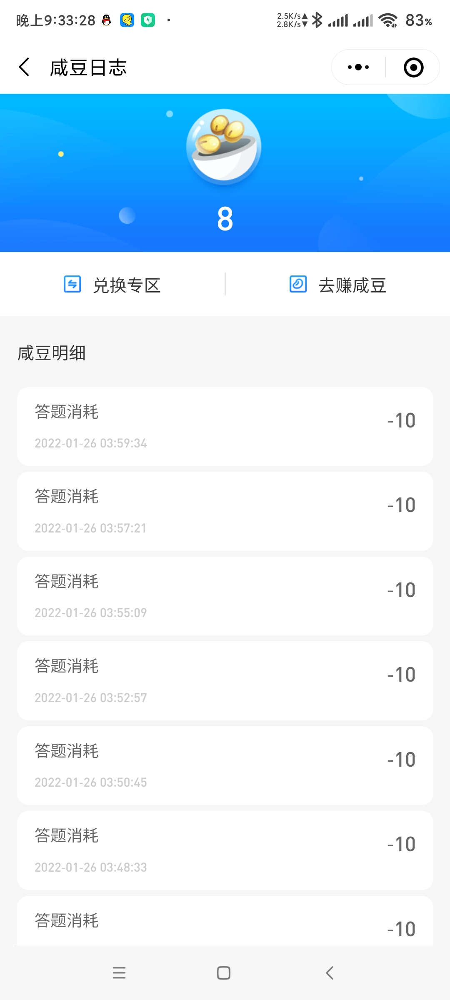
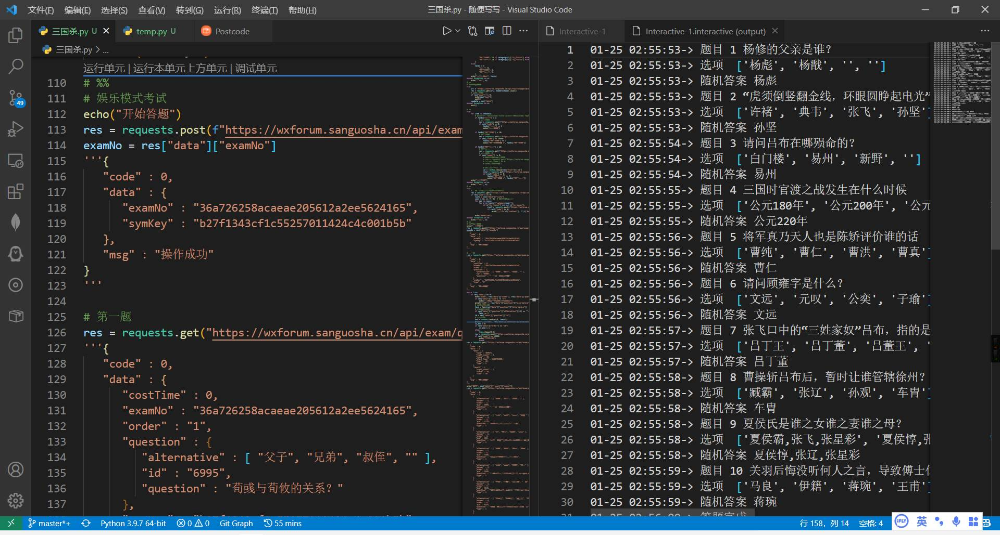
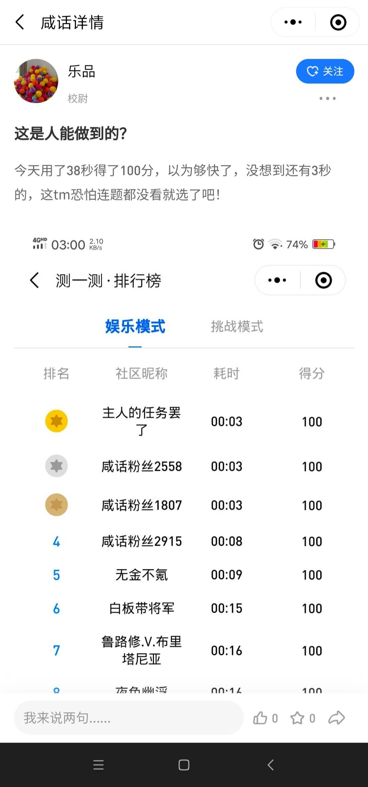

# 三国咸话签到脚本

#### 简介

创建时间：2022/01/10左右
只是随手写的一个签到、答题、刷积分脚本，不保证稳定性，仅供学习交流使用

有问题请发issue

#### 使用方法

抓包获取Authorization，填入 `main.py第7行`即可

#### 其他

由于没有可用的题库，所以我选择随机选项答题，最后将正确答案合并到MongoDB数据库。
每次答题时访问数据库，可以达到秒速满分。

| 简介 | 拿豆子'买'题 | 运行截图 | 社区人的疑惑 |
| ---- | ---- | ---- | ---- |
| 截图时间 | 2022/01/26 | 2022/01/25 | 2022/02/16 |
||  |  |  |

#### 使用方法
1. 导入数据库
   使用Mongodb Compass导入数据库文件`答题/questions.json`，路径sgs/questions
2. 每日答题
    使用`答题/sgsAndwer.py`作为服务端，在`答题/三国杀每日答题.py`填入Authorization，运行即可
3. 每日新闻
   安装`答题/requirement.txt`中的依赖，在`答题/三国杀每日新闻上传.py`填入Authorization，运行即可

很久没有用小程序了，所以小程序可能更新了API/很多新题，会有bug，如果有问题请发issue

