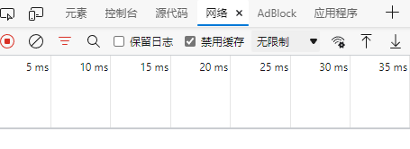
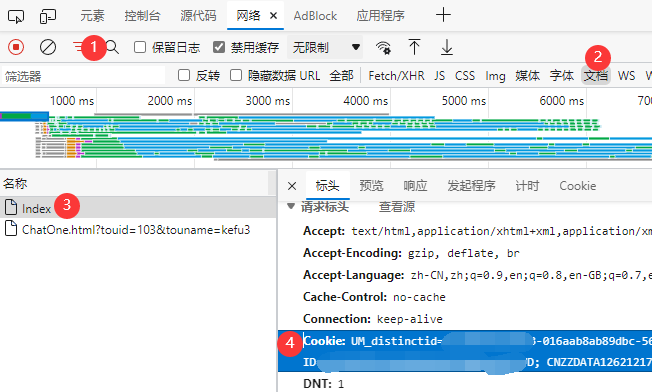
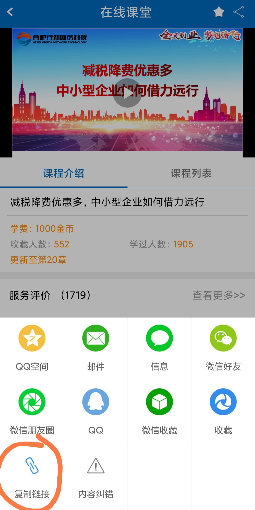

# 安徽省创业服务云平台刷课
#### 简介
只是随手写的一个刷课脚本,代码能跑就行hhh
有问题请发issue

#### 开源许可

本人不对任何后果负责，不放心请不要使用此项目
此项目禁止商业使用

### 一、获取cookie

电脑浏览器[打开网页](https://www.ahcy.gov.cn/Portal/Login)
用户登录之后,会自动回到主页面

然后按下键盘的F12,在弹出的窗口中找到 `网络`或者 `Network`

然后刷新浏览器页面，按下图的顺序点击，找到 `Index`页面里面的 `请求标头`里面的 `Cookie`,
复制保存

### 二、获取课程id

找到要刷课的课程，点击右上角分享，选择 `复制链接`

然后即可获得如此的链接 `https://www.ahcy.gov.cn//PeiXun/CourseDetail/8e72d57f9ee44813abee78e148a8085f`

取得最后的字符串·`8e72d57f9ee44813abee78e148a8085f`

打开 `index.py`，

1. 修改classid为该字符串
2. 在 `allinfo`里面按用户填入 cookie（name什么的无所谓，json格式不会的百度一下）
3. 然后开始运行即可

### 三、报错解决方法

- [重新获取](#一、获取cookie)cookie即可（大部分原因是cookie过期）
- 检查该课程是否购买
